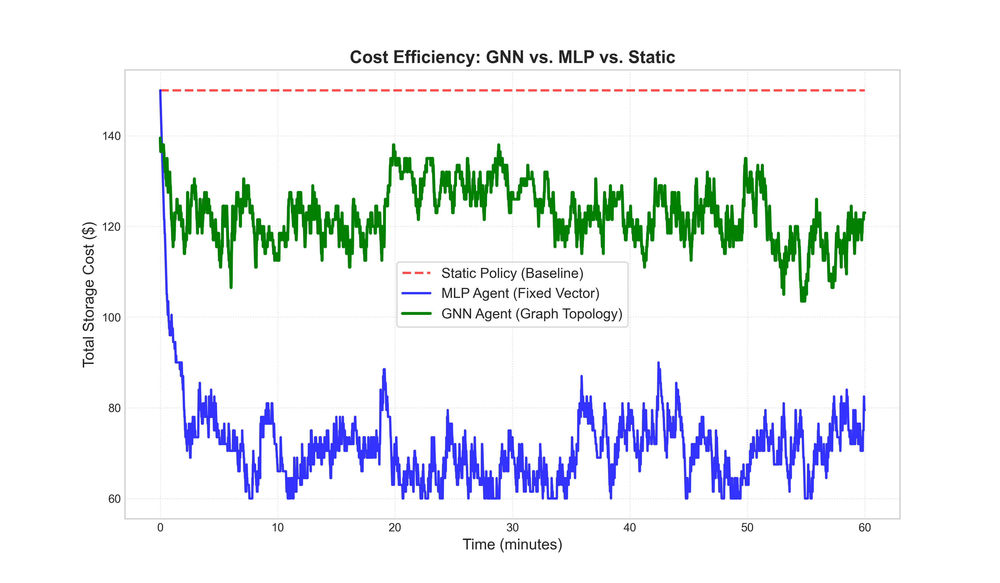

# Adaptive Data Replication using Reinforcement Learning

This project implements a simulated geo-distributed database where a Reinforcement Learning (RL) agent learns to make intelligent, real-time decisions about data replication. The AI agent acts as an autonomous "Replication Manager," learning a dynamic policy to replicate and evict data based on changing global read/write patterns, with the goal of minimizing latency and storage costs simultaneously.

## What is it?

In a global distributed database, naive replication strategies are inefficient. Replicating all data everywhere guarantees low read latency but incurs maximum storage costs. Replicating nothing is cheap but results in high latency for users far from the data's source. This project explores an alternative: training an RL agent to learn a dynamic replication policy.

The system models a complex trade-off problem, and the RL agent successfully learns to navigate it, outperforming static, heuristic-based approaches.

### How?
*   **AI:** Reinforcement Learning (PPO), Custom RL Environment Design (Gymnasium), Dynamic Optimization, Neural Networks (PyTorch).
*   **Systems:** Geo-Distributed Systems, Microservices, Data Replication, Containerization (Docker, Docker Compose).
*   **Languages & Frameworks:** Java, Spring Boot, Python, Stable-Baselines3.

---

## System Architecture

The project is a multi-container Docker application composed of four main services:


*(A sample diagram showing the components and their interactions)*

1.  **Replication Controller (`replicationcontroller`):** The central brain. A Java/Spring Boot service that acts as a router for all client traffic and exposes an API for the RL agent to manage the cluster.
2.  **Database Nodes (`replication`):** Java/Spring Boot services representing database instances in different geographic regions (e.g., `us-east`, `eu-west`). They store data, track read/write metrics, and simulate latency and cost.
3.  **Workload Generator (`workload-generator`):** A Python script that simulates a dynamic, global user base sending a continuous and shifting stream of read/write requests to the controller.
4.  **RL Agent (`rl-agent`):** The intelligence. A Python application that observes the system state via the controller, decides on an action (replicate/evict), and executes it.

---

## Implementation and Analysis of Architectures: MLP vs. Graph Neural Networks

To address the limitations of standard Reinforcement Learning in distributed systems, we implemented and compared two distinct deep learning architectures. This comparison explores the trade-off between **precision in fixed environments** versus **scalability in dynamic environments**.

### 1. The Specialist: Multi-Layer Perceptron (MLP)
*   **Architecture:** A standard Feed-Forward Neural Network (PPO).
*   **Input:** A flattened, fixed-size vector representing the state of specific keys on specific nodes.
*   **Behavior:** The MLP acts as a "Memorizer" It learns the specific identity of keys (e.g., "Key #5 is usually hot in Europe").
*   **Limitation:** It is brittle. The model cannot handle a variable number of keys or nodes. Adding a single new server requires retraining the entire model from scratch.

### 2. The Generalist: Graph Neural Network (GNN)
*   **Architecture:** A Graph Attention Network (GATv2) integrated with Ray RLlib.
*   **Input:** A dynamic graph where Keys and Servers are nodes, and replications are edges.
*   **Behavior:** The GNN acts as a "Topology Manager" It learns universal rules of physics for the system (e.g., "If *any* key has high read latency on a generic node, replicate it").
*   **Advantage:** It exhibits **Zero-Shot Transfer**. A policy trained on 5 keys can be deployed immediately on a cluster with 500 keys without retraining, as it learns to score relationships rather than memorizing IDs.

---

## Experiment 1: Small Scale (5 Keys / 3 Nodes)
In this baseline scenario, both agents were trained to minimize cost while maintaining a strict 10ms latency SLA.


**Analysis:**
*   Both architectures successfully outperformed the static baseline.
*   The MLP achieved slightly lower absolute costs by overfitting to the small, fixed number of keys.
*   The GNN learned a stable, effective policy that roughly matched the MLP's performance, proving that graph-based learning is viable even for small clusters.

---

## Experiment 2: Large Scale (20 Keys / 5 Nodes)
We scaled the environment complexity by 400%, introducing 5 global regions (US, EU, AP, SA, JP) and 20 distinct data keys with volatile traffic patterns.



**Analysis:**
*   **Static Baseline (Red):** Fixed at $150.00 (Max Cost).
*   **MLP Agent (Blue):** Achieved the lowest raw cost (~$70) by aggressively memorizing the specific traffic patterns of the 20 fixed keys. However, this policy is rigid and non-transferable.
*   **GNN Agent (Green):** Learned a robust topology-aware policy, reducing costs by ~20% (to ~$125) without memorizing specific keys. Crucially, this agent demonstrated **dynamic elasticity**, actively adding and removing replicas in real-time response to "chaotic" traffic spikes.
*   **Conclusion:** While the MLP wins on raw optimization for a *static* cluster size, the GNN provides a **scalable, general-purpose solution** suitable for real-world elastic clouds where the number of keys and nodes changes constantly.

---

## How to Run the Simulation

Follow these steps to reproduce the experiments for both architectures.

### Prerequisites
*   Docker & Docker Compose
*   Java 17+ & Maven
*   Python 3.9+ (Virtual Env recommended)

### Step 1: Launch the Infrastructure
Navigate to the project root and launch the 5-node cluster.
```bash
docker compose up --build